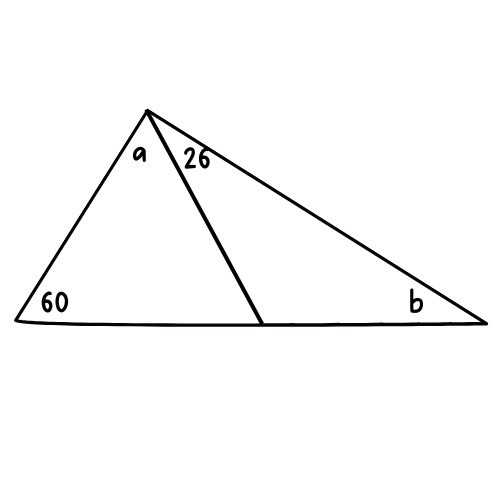

## **PRIMERA SERIE (aritmética, algebra ecuaciones inecuciones, funciones, geometría, analítica)**

1. Encuentre el número que tenga las siguientes características:

   * Tiene cuatro dígitos.
   * Ninguno de los dígitos se repite.
   * El dígito de las decenas es tres veces el dígito de las milésimas.
   * El número es impar.
   * La suma de todos los dígitos que lo componen es igual a 27.

    a) $5,967$ &emsp;&emsp;&emsp;
    b) $3,996$ &emsp;&emsp;&emsp;
    c) $3,791$ &emsp;&emsp;&emsp;
    d) $3,697$ &emsp;&emsp;&emsp;
    e) $3,897$
---
2. ¿Cuál de los siguientes números es más pequeño que $\frac{1}{3} + \frac{1}{2}$?
 
   a) $\frac{23}{24}$ &emsp;&emsp;&emsp;
   b) $\frac{7}{6}$ &emsp;&emsp;&emsp;
   c) $\frac{11}{12}$ &emsp;&emsp;&emsp;
   d) $\frac{1}{2}$ &emsp;&emsp;&emsp;
   e) $NAC$    
---
3. Si $k$ es un entero y $0.0010101 * 10^k$ es mayor que $1,000$. ¿Cuál es el valor que puede tener $k$?  
   
    a) $6$ &emsp;&emsp;&emsp;
    b) $2$ &emsp;&emsp;&emsp;
    c) $3$ &emsp;&emsp;&emsp;
    d) $4$ &emsp;&emsp;&emsp;
    e) $5$ &emsp;&emsp;&emsp;
---
4. &emsp; $(1+\sqrt{5})(1-\sqrt{5})$

    a) $2$ &emsp;&emsp;&emsp;
    b) $6$ &emsp;&emsp;&emsp;
    c) $-4$ &emsp;&emsp;&emsp;
    d) $-4 -2 \sqrt{5}$ &emsp;&emsp;&emsp;
    e) $6 -2 \sqrt{5}$ &emsp;&emsp;&emsp;
---
5. &emsp; $\frac{2}{3}$ de $50$% es igual a:

    a) $\frac{3}{2}$ &emsp;&emsp;&emsp;
    b) $\frac{1}{6}$ &emsp;&emsp;&emsp;
    c) $\frac{1}{18}$ &emsp;&emsp;&emsp;
    d) $\frac{1}{2}$ &emsp;&emsp;&emsp;
    e) $\frac{1}{3}$ &emsp;&emsp; &emsp;
---
6. ### &emsp; $\frac{21^{104}}{(7^{103})(3^{102})}$ =

    a) $21$ &emsp;&emsp;&emsp;
    b) $3$ &emsp;&emsp;&emsp;
    c) $147$ &emsp;&emsp;&emsp;
    d) $7$ &emsp;&emsp;&emsp;
    e) $63$ &emsp;&emsp;&emsp;
---
7. ¿Qué número es el que sigue la sucesión: $1, 8, 27, 64, ...$

    a) $100$ &emsp;&emsp;&emsp;
    b) $144$ &emsp;&emsp;&emsp;
    c) $88$ &emsp;&emsp;&emsp;
    d) $125$ &emsp;&emsp;&emsp;
    e) $NAC$ &emsp;&emsp;&emsp;

---
8. Si $x^2 -4x = 5$ y además $x-2=a$, y que $a$ es un número positivo. entonces ¿Cuál es el valor de $a$?

    a) $6$ &emsp;&emsp;&emsp;
    b) $2$ &emsp;&emsp;&emsp;
    c) $5$ &emsp;&emsp;&emsp;
    d) $3$ &emsp;&emsp;&emsp;
    e) $NAC$ &emsp;&emsp;&emsp;    

---
9. &emsp; $2^{2x}*3^{2x}=$ 

    a) $36x$ &emsp;&emsp;&emsp;
    b) $13^x$ &emsp;&emsp;&emsp;
    c) $5^{2x}$ &emsp;&emsp;&emsp;
    c) $6^{4x}$ &emsp;&emsp;&emsp;
    c) $36^{x}$ &emsp;&emsp;&emsp;

---
10. Si $a+b= 10$, entonces ¿Cuál es el punto medio entre $(0,b)$ y $(2,a)$?

    a) $(4,4)$ &emsp;&emsp;&emsp;
    b) $(1,5)$ &emsp;&emsp;&emsp;
    c) $(5,1)$ &emsp;&emsp;&emsp;
    d) $(4,2)$ &emsp;&emsp;&emsp;
    e) $NAC$ &emsp;&emsp;&emsp;

---
11. El punto $(a,b)$ se encuentra en la misma línea horizontal qu el punto $(1,2)$, si $a$ es igual a $3$. ¿Cuál es el valor de $a-b$?

    a) $4$ &emsp;&emsp;&emsp;
    b) $0$ &emsp;&emsp;&emsp;
    c) $1$ &emsp;&emsp;&emsp;
    d) $2$ &emsp;&emsp;&emsp;
    e) $3$ &emsp;&emsp;&emsp;

---
12. El número complejo $i^{32}$ es igual a:

    a) $1$ &emsp;&emsp;&emsp;
    b) $i$ &emsp;&emsp;&emsp;
    c) $-i$ &emsp;&emsp;&emsp;
    d) $-1$ &emsp;&emsp;&emsp;
    e) $i^3$ &emsp;&emsp;&emsp;

---
13. Si $x=\frac{z}{y}$ y $\frac{z}{u}=wy$, entonces $x$ es también igual a:

    a) $z+w$ &emsp;&emsp;&emsp;
    b) $\frac{y}{z}$ &emsp;&emsp;&emsp;
    c) $uw$ &emsp;&emsp;&emsp;
    d) $\frac{u}{z}$ &emsp;&emsp;&emsp;
    e) $NAC$ &emsp;&emsp;&emsp;

---
14. En la desigualdad $y+x > 15$, si $x=5$ y $y$ es un entero poitivo. ¿Cuál de los siguientes valores no puede ser igual a $xy$?:  
    
    a) $65$ &emsp;&emsp;&emsp;
    b) $60$ &emsp;&emsp;&emsp;
    c) $55$ &emsp;&emsp;&emsp;
    d) $50$ &emsp;&emsp;&emsp;
    e) $NAC$ &emsp;&emsp;&emsp;

---
## **SEGUNDA SERIE (modelado, razones y proporciones, geometría y trigonometría)**

15. Dos buses salen al mismo tiempo de la estación *"Justo Rufino Barrios"*. Uno  viajo al norte a 30 kilómetros por hora durante 10 horas hasta llegar al punto A. El otro bus viajo al este a 80 kilómetros por hora durante 5 horas hasta llegar al punt B. ¿Cuál es la distancia entre los  A y B?  
    
    a) $50 km$ &emsp;&emsp;&emsp;
    b) $450 km$ &emsp;&emsp;&emsp;
    c) $500 km$ &emsp;&emsp;&emsp;
    d) $100 km$ &emsp;&emsp;&emsp;
    e) $700 km$ &emsp;&emsp;&emsp;

---
16. Para obtener cierto permiso, la ley regula que solo puede dársele a personas que estén entre los 40 y 50 años cumplidos. ¿Cuál de las siguientes inecuaciones describe el enunciado anterior? ($e$ es la edad en años)

    a) $|e-40| \leq 50$ &emsp;&emsp;&emsp;
    b) $|e-30| \leq 10$ &emsp;&emsp;&emsp;
    c) $|e-30| \leq 5$ &emsp;&emsp;&emsp;
    d) $|e-45| \leq 5$ &emsp;&emsp;&emsp;
    e) $NAC$ &emsp;&emsp;&emsp;

---
17. Tres libras de frijo negro que cuestan $x$ quetzales por libra, son mezcladas con cuatro libras de frijol blanco qu cuestan $y$ quetzales por lilbra. ¿Cuál es el costo en quetzales, por libra de la mezcla?

    a) $3x+4y$ &emsp;&emsp;&emsp; 
    b) $\frac{3x+4y}{x+y}$ &emsp;&emsp;&emsp; 
    c) $\frac{3x+4y}{xy}$ &emsp;&emsp;&emsp; 
    d) $\frac{3x+4y}{12}$ &emsp;&emsp;&emsp; 
    c) $\frac{3x+4y}{7}$ &emsp;&emsp;&emsp; 

---
18. $B$ es inversamente proporcional al cuadrado de $C$. Cuando $B$ es $2$, el valor de $C$ es $3$. Si $C$ es igual a $2$, entonces el valor de $B$ es:

    a) $\frac{8}{9}$ &emsp;&emsp;&emsp;
    b) $\frac{9}{2}$ &emsp;&emsp;&emsp;
    c) $\frac{9}{4}$ &emsp;&emsp;&emsp;
    d) $\frac{9}{5}$ &emsp;&emsp;&emsp;
    e) $NAC$ &emsp;&emsp;&emsp;

---
19. Si hace $8$ años Enrique tenia 32 años. ¿Qué edad tenía hace $x$ años?

    a) $x-40$ &emsp;&emsp;&emsp;
    b) $x-24$ &emsp;&emsp;&emsp;
    c) $40-x$ &emsp;&emsp;&emsp;
    d) $24-x$ &emsp;&emsp;&emsp;
    e) $NAC$ &emsp;&emsp;&emsp;

---
20. Una herencia se peparte entre 5 hermanas, 2 hermanos y una prima. Si cada hermana recibió las séptima parte de la herencia y cada hermano la mitad de lo que recibió  cada una de las hermanas ¿Qué parte de la herencia recibió la prima?

    a) $\frac{2}{7}$ &emsp;&emsp;&emsp;
    b) $\frac{1}{7}$ &emsp;&emsp;&emsp;
    c) $\frac{5}{7}$ &emsp;&emsp;&emsp;
    d) $\frac{3}{14}$ &emsp;&emsp;&emsp;
    e) $\frac{11}{14}$ &emsp;&emsp;&emsp;

---
21. En el triángulo de la figura, ¿Qué expresión deja a "$a$" en térmions de "$b$"?   
  

    a) $b+94$ &emsp;&emsp;&emsp;
    b) $94-b$ &emsp;&emsp;&emsp;
    c) $b-94$ &emsp;&emsp;&emsp;
    d) $70-b$ &emsp;&emsp;&emsp;
    e) $70+b$ &emsp;&emsp;&emsp;

---
22.  Si el perímetro de una piscina rectangular es de 40 metros y su área es 75 metros cuadrados ¿Cuánto mide uno de los lados más cortos?

    a) $5 mts$ &emsp;&emsp;&emsp;
    b) $4 mts$ &emsp;&emsp;&emsp;
    c) $3 mts$ &emsp;&emsp;&emsp;
    d) $6 mts$ &emsp;&emsp;&emsp;
    e) $10 mts$ &emsp;&emsp;&emsp;

---
23. Los datos que se propocionan son tres distancias medidas en centímetros. ¿Con cuál de las siguientes opciones no se podría formar un triángulo?

    a) $1,2,3$ &emsp;&emsp;&emsp;
    b) $3,4,5$ &emsp;&emsp;&emsp;
    c) $6,8,10$ &emsp;&emsp;&emsp;
    d) $1,2,2$ &emsp;&emsp;&emsp;
    e) $4,4,4$ &emsp;&emsp;&emsp;

---
24. ¿Cúanto mide la mitad del área superficial de un cubo de volumen igual a $64$ centímetros cúbicos?

    a) $40 cm^2$ &emsp;&emsp;&emsp;
    b) $48 cm^2$ &emsp;&emsp;&emsp;
    c) $24 cm^2$ &emsp;&emsp;&emsp;
    d) $96 cm^2$ &emsp;&emsp;&emsp;
    e) $32 cm^2$ &emsp;&emsp;&emsp;

---
25. Si en un triángulo rectángulo el $senθ=\frac{3}{5}$ ¿Cuál sería entonces el $cosθ$?

    a) $\frac{5}{3}$ &emsp;&emsp;&emsp;
    b) $\frac{4}{5}$ &emsp;&emsp;&emsp;
    c) $1$ &emsp;&emsp;&emsp;
    d) $\frac{5}{4}$ &emsp;&emsp;&emsp;
    e) $NAC$ &emsp;&emsp;&emsp;

